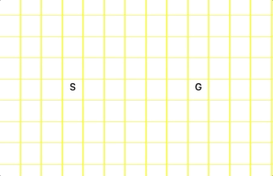
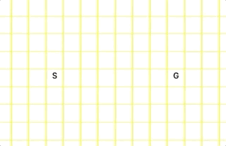
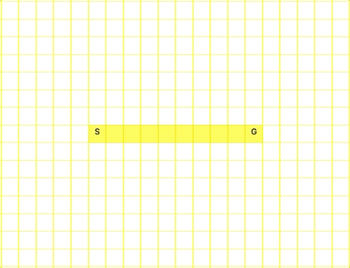
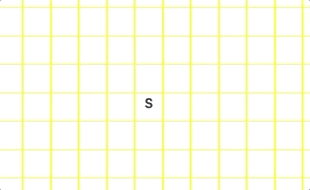

Check out the visualizer ---> [path-find-visualizer](https://tlee10.github.io/path-find-visualizer).

## Available Features

### `Move Start/Goal node`

Drag either of the special nodes to the position of your liking.

### `Choose feature to add to the graph`

You can add walls(default) or weights(only works with weighted algo) to the graph. Watch how these features affect the result obtained.

### `Learn about any node's information`

`Right click` at any node that you want to check out its details.

### `Animate away!!`

Enjoy the animation and observe how each algorithm works

## Uninformed Search

All search strategies that fall under this category have no additional information other than what's given in the problem definition. This category of search expands nodes without any knowledge of its domain.

### `Breadth First Search`
This algorithm expands the **shallowest unexpanded node**(the first node in open list). The open list is implemented using a FIFO queue. 

Optimal solution will be obtained in a unweighted graph.

### `Depth First Search`
This algorithm expands the **deepest unexpanded node**(the last node in open list). The open list is implemented using a LIFO queue.

This algorithm is not optimal.

### `Dijkstra`
This algorithm expands node that has the **lowest cost accumulated** among all nodes in the open list. The open list is implimented using a priority queue.

Used in a weighted graph.

Optimal solution will be obtained if goal test is tested at expansion rather than generation.

## Informed Search

All search strategies that fall under this category expand nodes based on an evaluation function `f(n)`. The evaluation function is construed as a cost estimate. The node that has the **lowest** evaluation is expanded first.

In this project, `Manhattan Distance` is used as the heuristic function `h(n)` by all informed search strategies. Manhattan Distance calculates the total distance between 2 nodes in both x and y axis of a plane.

### `Greedy Best First Search`

This algorithm is greedy because it expands the node that is estimated to be the closest to the goal by the heuristic function. `f(n) = h(n)`

This algorithm is not optimal.

### `A*`

This algorithm uses an evaluation function that combines the cost accumulated and future cost to reach the goal to order the nodes in the open list. `f(n) = g(n) + h(n)` where g(n) = cost accumulated.

This algorithm is optimal and is used in a weighted graph.

